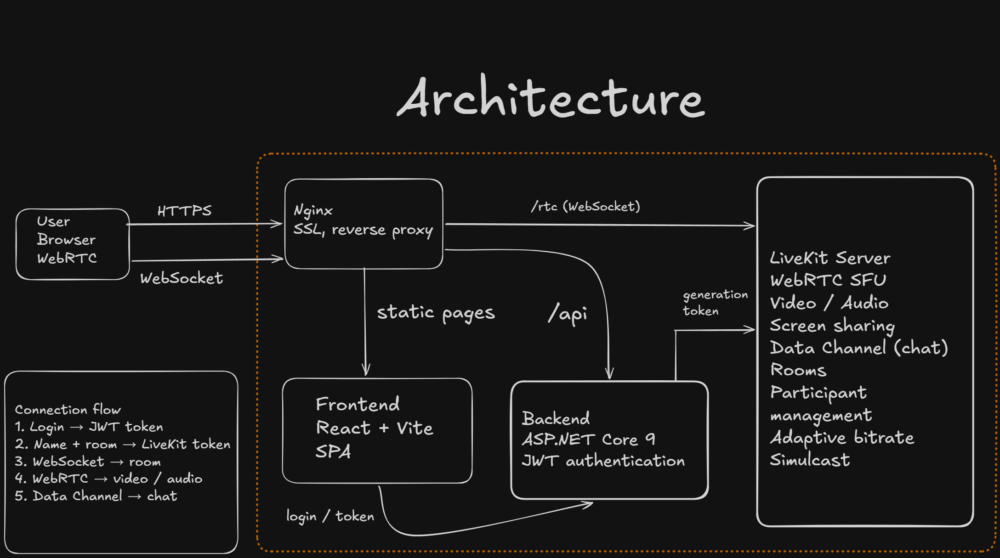

# Together

Групповые видеозвонки с демонстрацией экрана, чатом и настройками устройств.

## Архитектура



### Как работает подключение

```
Пользователь (Браузер)
       │
       │  1. HTTPS: логин/пароль
       ▼
    Nginx (SSL, reverse proxy)
       │
       ├──→ Frontend (React SPA) — отдаёт статику
       │
       ├──→ Backend (.NET API)
       │       │
       │       │  2. Проверяет логин/пароль
       │       │  3. Возвращает JWT сессионный токен
       │       │
       │       │  4. Принимает JWT + имя + комнату
       │       │  5. Генерирует LiveKit Access Token
       │       ▼
       │    LiveKit Server (WebRTC SFU)
       │       │
       │       │  6. WebSocket: подключение к комнате
       │       │  7. WebRTC: видео, аудио, экран
       │       │  8. Data Channel: текстовый чат
       │       ▼
       └──→ /rtc → LiveKit (проксирует WebSocket)
```

### Компоненты

**Frontend** — React + Vite SPA с тремя экранами:
- **Login** — ввод логина и пароля, получение JWT-токена
- **Lobby** — выбор имени, комнаты, аватара, настройка микрофона/камеры/динамиков, тест микрофона
- **Call** — видеозвонок: сетка участников, управление микрофоном/камерой/экраном, чат, настройки качества

**Backend** — ASP.NET Core 9:
- `POST /api/authorization/login` — аутентификация, возвращает JWT
- `POST /api/authorization/token` — генерация LiveKit Access Token (требует JWT)
- JWT-аутентификация, Swagger, Serilog, Health Checks

**LiveKit** — Open-source WebRTC SFU (Selective Forwarding Unit):
- Не перекодирует медиа, а пересылает между участниками
- Адаптивный битрейт, simulcast (несколько слоёв качества)
- Комнаты, управление участниками, Data Channel для чата

### Стек

| Слой | Технологии |
|------|-----------|
| Frontend | React, Vite, livekit-client |
| Backend | .NET 9, ASP.NET Core, JWT, Serilog |
| Медиа | LiveKit Server (WebRTC SFU) |
| Прокси | Nginx (SSL termination, reverse proxy) |
| Развёртывание | Docker, Docker Compose |

## Настройка секретов

Перед запуском нужно создать два файла с секретами:

### 1. `backend/Together/appsettings.Development.json`

```json
{
  "LiveKit": {
    "ApiKey": "ваш-api-key",
    "ApiSecret": "ваш-api-secret"
  },
  "Jwt": {
    "Secret": "секрет-минимум-32-символа"
  },
  "AdminProfile": {
    "user_name": "логин",
    "password": "пароль"
  }
}
```

### 2. `livekit/livekit.yaml`

Скопируйте `livekit/livekit.yaml.example` и заполните реальными значениями:

```yaml
keys:
  ваш-api-key: ваш-api-secret
```

## Развёртывание на сервере

```bash
# Собрать и запушить образы
./deploy.sh

# На сервере:
cd /opt/together
docker compose -f docker-compose.server.yml pull
docker compose -f docker-compose.server.yml up -d
```

Для HTTPS нужно получить SSL-сертификаты (например, через Let's Encrypt) и указать пути в `docker-compose.server.yml`.