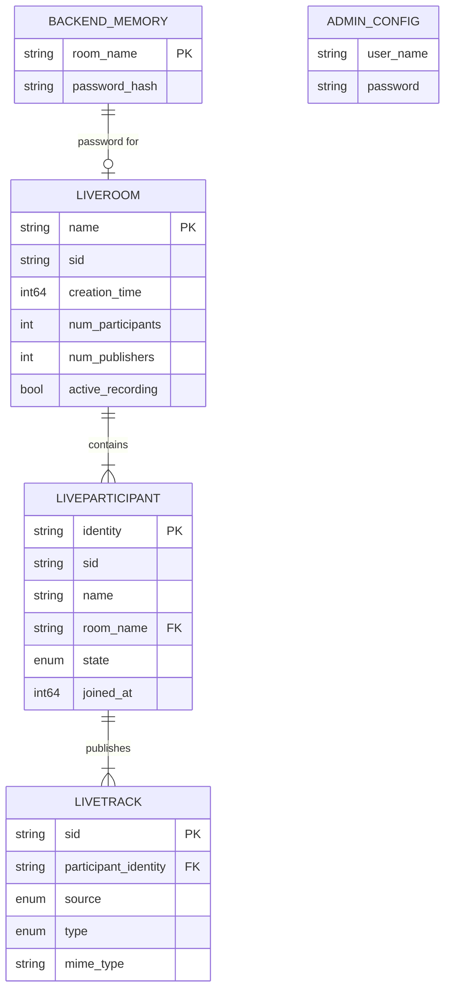

# Модель данных

## In-memory модель (Backend)

Together не использует БД. Все данные хранятся в памяти процесса и/или в LiveKit Server.

### RoomService — ConcurrentDictionary

```
┌─────────────────────────────────────────────────────┐
│  ConcurrentDictionary<string, string> _rooms        │
│                                                     │
│  Key:    roomName (string)                          │
│  Value:  SHA256 hash пароля (hex string)            │
│                                                     │
│  Пример:                                            │
│    "Моя комната" → "a3f2b8c1d4e5..."               │
│    "Общая"       → (отсутствует = публичная)        │
└─────────────────────────────────────────────────────┘
```

Если комната есть в словаре — она приватная (нужен пароль). Если нет — публичная.

**Свойства:**
- Пароли хранятся как SHA256-хеши (не plain text)
- Валидация: `SHA256(введённый_пароль) == stored_hash`
- Рестарт бэкенста = потеря всех паролей (комнаты в LiveKit остаются, но становятся публичными)

### AdminProfile — конфигурация

```
appsettings.json → AdminProfile
├── user_name: string   — логин (constant-time compare)
└── password: string    — пароль (constant-time compare)
```

Один профиль, нет регистрации, нет ролей. Аутентификация через `CryptographicOperations.FixedTimeEquals`.

## LiveKit Data Model

LiveKit Server управляет комнатами и участниками. Backend взаимодействует через SDK.

### Room

```
┌──────────────────────────────────────┐
│  LiveKit Room                        │
│                                      │
│  name: string          — имя комнаты │
│  sid: string           — уникальный ID│
│  creation_time: int64  — Unix ts     │
│  turn_password: string │
│  enabled_codecs: []    │
│  num_participants: int │
│  num_publishers: int   │
│  active_recording: bool│
└──────────────────────────────────────┘
```

### Participant

```
┌──────────────────────────────────────────────────┐
│  LiveKit Participant                             │
│                                                  │
│  sid: string              — participant SID       │
│  identity: string         — уникальный identity   │
│  name: string             — отображаемое имя      │
│  state: enum              — JOINED/ACTIVE/etc     │
│  tracks: Track[]          — опубликованные треки  │
│  metadata: string         │
│  joined_at: int64         │
│  connection_quality: enum │
└──────────────────────────────────────────────────┘
```

Identity генерируется как `{displayName}-{random_hex_4}` (см. `LiveKitService.GenerateTokenAsync`).

### Track

```
┌─────────────────────────────────────────┐
│  Track                                  │
│                                         │
│  source: enum    — CAMERA/SCREEN_SHARE/ │
│                    MICROPHONE/etc        │
│  type: enum      — AUDIO/VIDEO          │
│  mime_type: string│
│  width: int      — для видео            │
│  height: int     │
│  simulcast: bool │
└─────────────────────────────────────────┘
```

### Token (Access Token)

Генерируется бэкендом для фронтенда:

```
AccessToken
├── api_key: string        — из конфига
├── api_secret: string     — из конфига
├── identity: string       — {displayName}-{XXXX}
├── name: string           — displayName
├── grants: VideoGrants
│   ├── room_join: true
│   └── room: roomName
└── → JWT string           — фронтенд использует для WebSocket подключения
```

## ER-диаграмма (Mermaid)



## Data Flow — State Transitions

```
Комната создана (без пароля):
  LiveKit: Room exists
  Backend: нет записи в _rooms
  → Публичная комната

Комната создана (с паролем):
  LiveKit: Room exists
  Backend: _rooms["name"] = SHA256(password)
  → Приватная комната

Рестарт бэкенда:
  LiveKit: Room exists (если empty_timeout не истёк)
  Backend: _rooms пуст
  → Комната стала публичной

Все участники вышли:
  Фронтенд: deleteRoom() при handleLeave
  Backend: проверяет num_participants → если 0 → удаляет из LiveKit + _rooms
  → Комната удалена

Все участники вышли (сеть упала):
  Фронтенд: не вызывает deleteRoom
  LiveKit: empty_timeout=60 → комната удалена через 60 секунд
  Backend: _rooms[hash] остаётся (утечка, не критично)
```